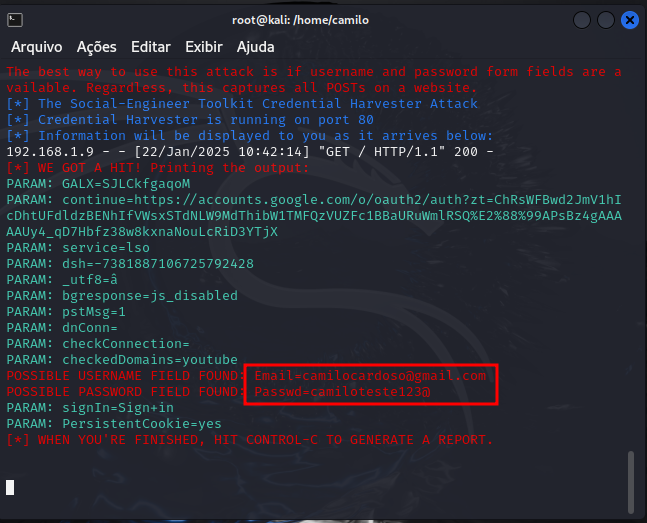

<h1 align="center">🖼️ CIBER DESAFIO PHISHING</h1> 

## Desenvolvedore
Camilo Rocha 

## 📋 Descrição 

Desafio de Segurança Cibernética: Criando e Identificando Phishing para Treinamento.  

Método de ataque: Site Cloner
Obtendo o endereço da máquina: ifconfig

#### Dito isto, vamos para como o projeto funciona:

1. Dentro do Kalin utilizer acesso root com o comando: "sudo su"  

2. No kalin dentro do terminal digite: "ifconfig" e guarde o numero de IP, que ira utilizar futuramente 

3. No kalin vamos utilizar a ferramentas Setoolkit dentro do terminal digite : setoolkit 

4. Selecione a opcao: "Social-Engineering Attacks"  
    
5. Selecione a opcao: "Web Site Attack Vectors"   

6. Selecione a opcao: "Credential Harvester Attack Method"  

7. Selecione a opcao: "Web Templates"  

8. Digite o ip que voce capturou na etapa 2   

9. Selecione a opcao dos exemplos que tem disponivel, eu utilizei do Google   

10. Apos isso abra o navegador e digite o ip capturado na etapa 2 e vera que abrira o site para o phishing  

## 🚧 PRINT DEMOSTRATIVO

## 🚧 VIDEO DEMOSTRATIVO

